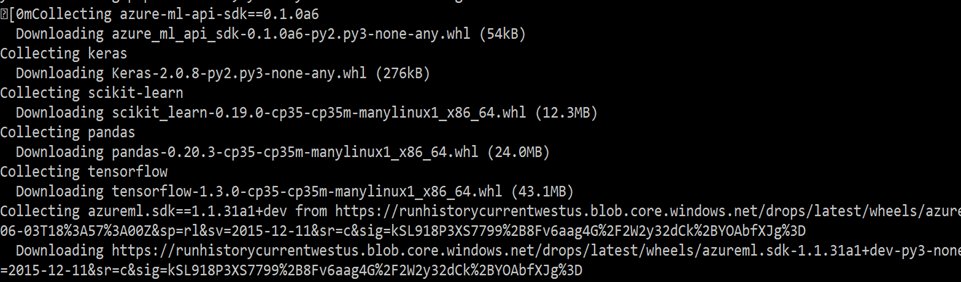

# Sentiment Analysis using Deep Learning: Modeling in Docker

**AT** POINT TO THE SCRIPT WHICH EXECUTES THESE STEPS. PERHAPS YOU COULD COMBINE THIS MD FILE AND THE PYTHON SCRIPT INTO A JUPYTER NOTEBOOK.

## 1. Objectives

The aim of this guide is to show how to create a sentiment classifier in a docker container on your local computer. In this lab, we will reproduce the steps captured in data preparation using pandas to be able to run in a docker container.

## 2. Data Preparation

The csv file can be read using pandas into a dataframe df as shown below:

```
def read_reviews_from_csv(dataset):
    df = pd.read_csv(dataset, encoding='cp437', sep='|')
    df = df.apply(lambda x: x.astype(str).str.lower())
    return df
```

Rest of the code related to modeling is pretty much the same as in the previous lab.

3. Execution – Local Docker Container

Ensure conda_dependencies.yml contains dependencies as follows:

```
dependencies:
  - python=3.5.2
  - ipykernel=4.6.1
  - pip: 
    - azure-ml-api-sdk==0.1.0a6   
    - keras    
    - scikit-learn
    - pandas
    - tensorflow
    - h5py
```
    
If you have a Docker engine running locally, in the CLI window, run the below command. Note the change the run configuration from local to docker.

```
az ml experiment submit -c docker SentimentExtractionDocker.py
```

This command pulls down a base docker image, layers a conda environment on the base image based on the conda_dependencies.yml file in your_aml_config_ directory, and then starts a Docker container. You will be able to see the dependencies as follows:



It then executes your script. You should see some Docker image construction messages in the CLI window. In the end, on successful execution, you will see result as shown below with the sentiment score.


