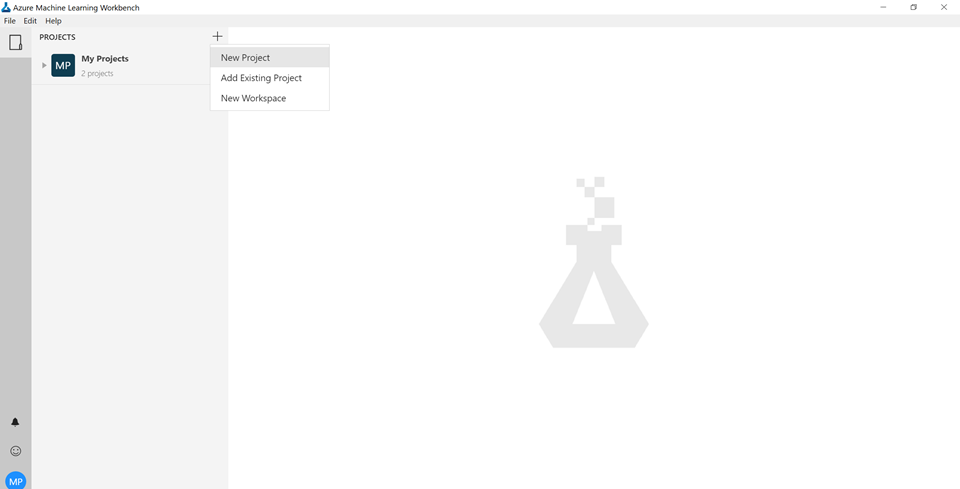
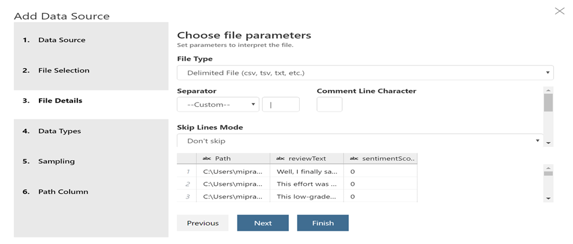
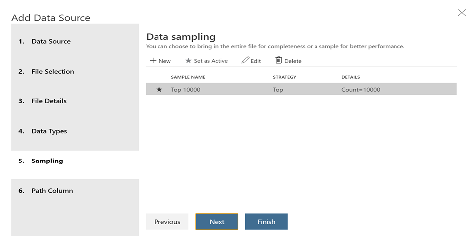
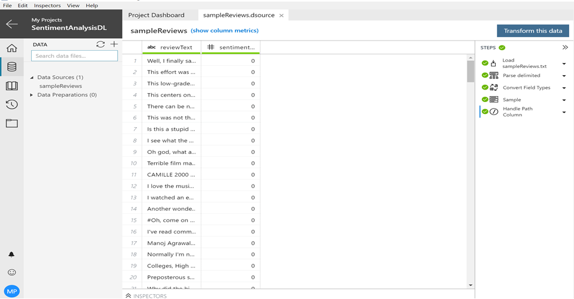
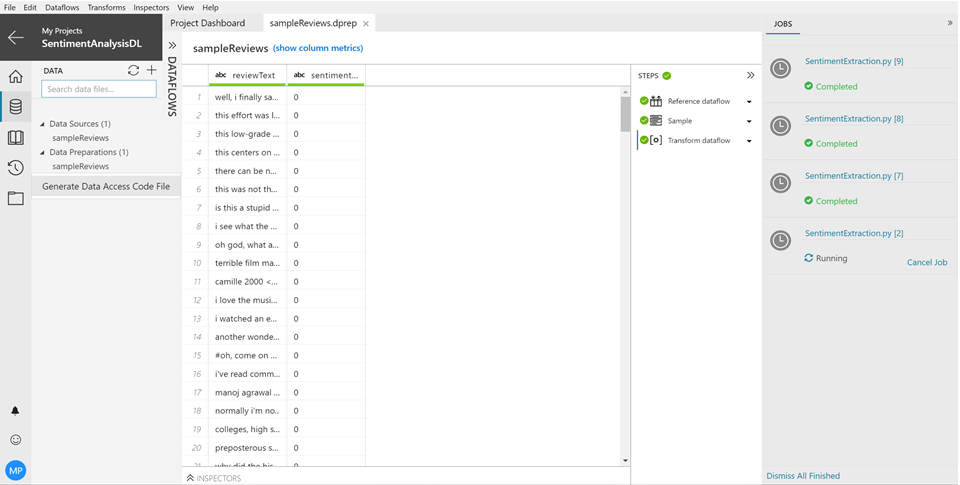

# Sentiment Analysis using Deep Learning - Data Preparation

## 1. Objectives

The aim of this lab is to understand how Vienna’s Data Preparation tools can be used to clean and ingest IMDB Movie review data for predicting sentiment using Deep Learning.

The objective of this lab is to use CNTK as the backend for Keras (a model level library, providing high-level building blocks for developing deep learning models) and implement sentiment analysis from movie reviews.

## 2. Setup

2.1. Begin the lab by creating a New Project by selecting the plus sign from Recent Projects.



2.2. Provide a project name, project directory and select a blank project template as next steps. For the project directory, create a new directory for sentiment analysis and copy the path to project directory in the wizard.


## 3. Data Source

Data Preparation is part of the Vienna client experience and installed with it. Data Preparation provides a set of flexible tools to help explore, discover, understand and fix problems in the raw data file before consuming it for modeling.

3.1.	Select Data Sources and click the + sign to add Data Source.
3.2.	In the Add Data Source wizard, select File (from git data folder) and provide the path of the local file.


3.3. In the File Details part of Add Data Source wizard, leave all the default options as is. You will be able to preview the data import as shown below.



3.4. In the Data Types part of Add Data Source wizard, notice how all the numeric fields are shown with the Type: Number. If no type is specified, string is assumed. Hence, you do not need to add the type for all the categorical features.


3.5. In the Sampling part of Add Data Source wizard, select sample: “Top 1000 (Active)” and leave all other options default. Vienna allows users to have multiple samples per data source. The Active indicator lets the user choose which sample to use when displaying the data source.



3.6. Do not include path column in the Path Column part of Add Data Source wizard as we will not need this information. Select Finish.


3.7. Select Transform this data



3.8. Select Transforms -> Transform Dataflow (Script) to open the following Script window. The data imported is in the form of a dataframe df. Lower case the reviews using the expression:

```
df = df.apply(lambda x: x.astype(str).str.lower())
```



## 4. Exercise

*	Can you add another expression to remove punctuations?

*	Can you remove stopwords?


