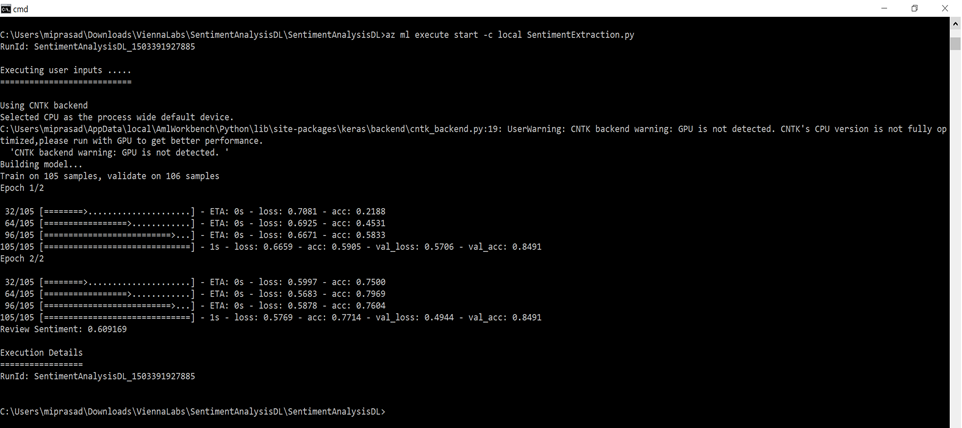
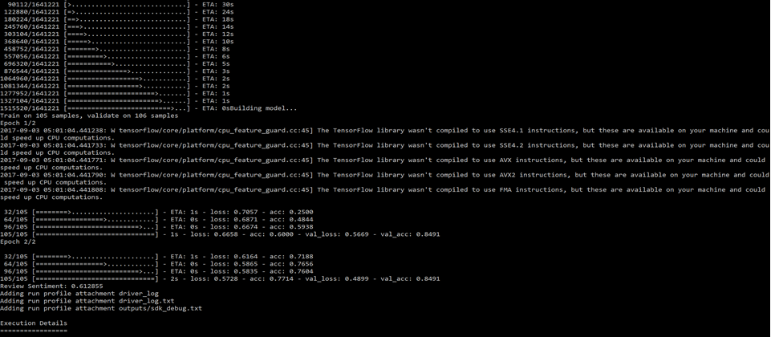

# Sentiment Analysis using Deep Learning: Modeling using Keras

The script that executes the below steps is [SentimentExtraction.py](https://github.com/Azure/MachineLearningSamples-SentimentAnalysis/blob/master/SentimentExtraction.py)

## 1. Objectives

Keras does not handle low-level operations such as convolutions itself. Instead, it relies on a specialized, well-optimized library to do so, serving as the "backend engine" of Keras. Keras being modular, several different backend engines can be plugged seamlessly into Keras.

The objective of this guide is to use Keras for sentiment analysis from movie reviews using deep learning.

This guide shows:
* How to import movie reviews and perform preprocessing
* How to use word embeddings for natural language problems
* How to train a recurrent convolutional network on the IMDB sentiment classification task

## 2. Problem

The IMDB movie dataset consists of moving reviews with positive and negative sentiment. In this problem, we will use a small dataset of movie reviews to perform modeling and determine whether a given movie review has a positive or negative sentiment.

## 3. Backend

If you do not have Keras and h5py installed, you can install it using
```
pip install keras
pip install h5py
```
If you have run this command at least once, you will find the Keras configuration file at:

```
C:\Users\<username>\.keras\keras.json
```

If it isn't there, you can create it. The default configuration file looks like this:

```
{ 
"image_data_format": "channels_last",
"epsilon": 1e-07, 
"floatx": "float32", 
"backend": "tensorflow" 
}
```

Change the field backend to engine of your choice, and Keras will use the new configuration next time you run any Keras code.

keras.json details:

* **image_data_format**: string, either **"channels_last"** or **"channels_first"**. It specifies which data format convention Keras will follow. (**keras.backend.image_data_format()** returns it.)
* For 2D data (e.g. image), **"channels_last"** assumes **(rows, cols, channels)** while **"channels_first"** assumes **(channels, rows, cols)**. 
* **epsilon**: float, a numeric fuzzing constant used to avoid dividing by zero in some operations.
* **floatx**: string, **"float16"**, **"float32"**, or **"float64"**. Default float precision.
* **backend**: string, **"tensorflow"** or **"theano"**.

## 4. Loading Movie Review Data

The train_model() function loads the [review dataset](https://github.com/Azure/MachineLearningSamples-SentimentAnalysis/blob/master/Data/sampleReviews.txt) and builds a deep learning model. Utilize the dprep file created after transformations to load in train_model:

```
df = run('sampleReviews.dprep', dataflow_idx=0)
    rows, columns = df.shape
    reviews_list = []
    labels_list = []
    
    for i in range(0, rows):
        try:
            labels_list.append(int(float(df.iloc[i,1])))
            reviews_list.append(df.iloc[i,0])
        except UnicodeEncodeError:
            pass
```

## 5. Parameters


* **max_features**: sets the vocabulary size. If we are only interested in the first 5,000 most used words in the dataset, vocabulary size will be 5,000.
* **maxlen**: maxlen is used to truncate or pad the dataset to a length of maxlen for each observation using the sequence.pad_sequences() function.
* **batch_size**: number of samples that are going to be propagated through the network.
* **epochs**: an arbitrary cutoff, defined as "one pass over the entire dataset”
* **embedding_dims**: dimension of the dense embedding
* **filters**: number of filters in the convolution
* **kernel_size**: length of the 1D convolution window
* **hidden_dims**: used for the dimensionality of the output space of Dense layer

```
def train_model(dataset, ratio=.5):
    #set parameters:
    max_features = 5000
    maxlen = 400
    batch_size = 32
    embedding_dims = 50
    filters = 250
    kernel_size = 3
    hidden_dims = 250
    epochs = 2
    seed = 113
    # get the reviews_list and labels_ist from the csv file

    df = run('sampleReviews.dprep', dataflow_idx=0)
    rows, columns = df.shape
    reviews_list = []
    labels_list = []
    
    for i in range(0, rows):
        try:
            labels_list.append(int(float(df.iloc[i,1])))
            reviews_list.append(df.iloc[i,0])
            # print(df.iloc[i,0] + ' ' + df.iloc[i,1])
        except UnicodeEncodeError:
            pass

    # get the corresponding vectors from the data set
    reviews_list_vec = get_vectors_from_text(reviews_list)
    # shuffle the data set
    np.random.seed(seed)
    np.random.shuffle(reviews_list_vec)
    np.random.seed(seed)
    np.random.shuffle(labels_list)
    # split the data set into train and test data
    x_train = reviews_list_vec[:int(len(reviews_list)*ratio)]
    y_train = labels_list[:int(len(labels_list)*ratio)]
    x_test = reviews_list_vec[int(len(reviews_list)*ratio):]
    y_test = labels_list[int(len(labels_list)*ratio):]
    print('Building model...')
    model = Sequential()
    # we start off with an efficient embedding layer which maps
    # our vocab indices into embedding_dims dimensions
    model.add(Embedding(max_features,
                        embedding_dims,
                        input_length=maxlen))
    model.add(Dropout(0.2))
    # we add a Convolution1D, which will learn filters
    # word group filters of size filter_length:
    model.add(Conv1D(filters,
                     kernel_size,
                     padding='valid',
                     activation='relu',
                     strides=1))
    model.add(GlobalMaxPooling1D())
    model.add(Dense(hidden_dims))
    model.add(Dropout(0.2))
    model.add(Activation('relu'))
    model.add(Dense(1))
    model.add(Activation('sigmoid'))
    
    model.compile(loss='binary_crossentropy',
                  optimizer='adam',
                  metrics=['accuracy'])
    model.fit(x_train, y_train,
              batch_size=batch_size,
              epochs=epochs,
              validation_data=(x_test, y_test))
    return model
```

The above function converts review text into vectors using get_vectors_from_text. The sentences in each review are therefore comprised of a sequence of integers (ordered by the popularity of the word).

## 6. Model

In this guide, we show how to build a sequential model which is a linear stack of layers. The model consists of the following types of layers:

6.1. Embedding layer: This layer transforms words into their corresponding word embeddings. The weights of the Embedding layer are of the shape (vocabulary_size, embedding_dimension).

6.2. Dropout layer: This layer includes regularization, which aims to reduce the complexity of the model with the goal to prevent overfitting.

6.3. ID Convolution layer: This layer creates a convolution kernel that is convolved with the layer input over a single spatial (or temporal) dimension to produce a tensor of outputs.

6.4. Activation layer: applies an activation function to a layer.

6.5. Global max pooling layer

## 7. Sentiment Prediction

The sentiment prediction predict_review() takes model and review_text as arguments and performs sentiment prediction. The function first converts the review_text to a vector using get_vectors_From_text

```
def predict_review(model,review_text):
    '''
    Predict the sentiment of the review text.
    @param
        model:       SequentialModel which we trained the data on.
        review_text:        Review text to predict
    @returns
        sentiment score on the review text.
    '''
    # convert the review text into vector 
    x_predict = get_vectors_from_text([review_text])[0]    
    # reshape the x_predict 
    x_predict = np.reshape(x_predict,(1,len(x_predict)))     
    # predict on the model

    return model.predict(x_predict)[0][0]
```

The sentiment score for a sample text can be obtained as follows:

```
dataset = 'sampleReviews.txt'
review_text = 'i loved the movie'
# now train the odel using the dataset
model = train_model(dataset)
print("Review Sentiment:", predict_review(model, review_text.lower()))
```

## 8. Local Execution

Select File->Open Command-Line Interface and run the following command to see results as illustrated below:

```
az ml experiment submit -c local SentimentExtraction.py
```




## 9. Without dprep

The reviews csv file can also be read using pandas into a dataframe df as shown below and not via dprep:

```
def read_reviews_from_csv(dataset):
    df = pd.read_csv(dataset, encoding='cp437', sep='|')
    df = df.apply(lambda x: x.astype(str).str.lower())
    return df
```

## 10. Execution – Local Docker Container

If you have a Docker engine running locally, in the CLI window, run the below command. Note the change in run configuration from local to docker.

```
az ml experiment submit -c docker SentimentExtraction.py
```

This command pulls down a base docker image, layers a conda environment on the base image based on the conda_dependencies.yml file in your_aml_config_ directory, and then starts a Docker container. You will be able to see the dependencies as follows:


It then executes your script. You should see Docker image construction messages in the CLI window. In the end, on successful execution, you will see the sentiment score.


